# IRC Server Module Guide

이 문서는 현재 `current.zip` 코드 기준으로 모듈 경계, 전체 실행 흐름, 테스트 방법, 예상 결과를 정리한 문서다.

참고 근거:

- IRC 메시지 형식과 `CR-LF` 종료 규칙: [RFC 1459, 2.3 Messages](https://www.ietf.org/rfc/rfc1459.txt)
- IRC command 목록과 의미: [RFC 1459, 4. Message details](https://www.ietf.org/rfc/rfc1459.txt)

## 전체 구조

```text
main
 -> Server
    -> ServerSocket
    -> ClientManager
    -> ClientPollEventHandler
    -> Parser
    -> ServerMessageSwitch
       -> CommandUser
       -> CommandJoinPart
       -> CommandMessage
       -> CommandInfo
       -> CommandInviteKick
       -> CommandMode
    -> ChannelManager
       -> Channel
```

큰 기준은 아래처럼 나눈다.

| 모듈 | 역할 |
|---|---|
| `main` | 실행 인자 검증 후 `Server` 시작 |
| `server` | socket 준비, `poll()` loop, client accept, terminal 입력, message 분기 |
| `client` | 연결된 client 상태와 raw receive/send buffer 저장 |
| `parser` | client receive buffer에서 `\r\n` 기준으로 한 줄을 꺼내고, name/params로 파싱 |
| `command` | 파싱된 message를 보고 실제 IRC 명령 실행 |
| `channel` | channel 상태, member/operator/invite/mode/topic 관리 |

## 실행 흐름

```mermaid
flowchart TD
    A["main(argc, argv)"] --> B["Server::run()"]
    B --> C["ServerSocket::setup()"]
    C --> D["Server::runEventLoop()"]
    D --> E["poll()"]
    E --> F{"fd 종류"}
    F -->|listen fd| G["acceptPendingClients()"]
    F -->|client fd| H["ClientPollEventHandler::handleEvent()"]
    F -->|stdin| I["handleTerminalInput()"]
    H --> J["ClientSocketReceiver::receive()"]
    J --> K["Client::appendReceived()"]
    K --> L["Parser::popLine() / parse()"]
    L --> M["ServerMessageSwitch::branch()"]
    M --> N["Command...::execute...()"]
    N --> O["Client::queueSend()"]
    H --> P["ClientSocketSender::sendPending()"]
```



핵심 흐름은 이렇다.

1. `main.cpp`가 port/password를 검사한다.
2. `Server`가 listen socket을 만들고 non-blocking으로 설정한다.
3. `poll()`이 listen fd, client fd, server terminal 입력을 기다린다.
4. 새 연결이면 `ServerSocket::acceptClient()` 후 `ClientManager::add()`로 client를 저장한다.
5. client fd에 `POLLIN`이 오면 `recv()`로 bytes를 읽고 `Client` receive buffer에 저장한다.
6. `Parser`가 receive buffer에서 `\r\n`까지 한 줄을 꺼내고, name/params로 나눈다.
7. `ServerMessageSwitch`가 message name을 보고 어느 command 객체로 넘길지 분기한다.
8. `Command...` 객체가 실제 명령을 처리하고 응답을 client send buffer에 쌓는다.
9. 다음 `poll()`에서 해당 client fd에 `POLLOUT`이 잡히면 `send()`로 응답을 보낸다.

## `main` 모듈

### 파일

| 파일 | 역할 |
|---|---|
| `srcs/main.cpp` | 실행 인자 검사, port/password 검증, `Server` 생성 |

### 상세

`main`은 서버의 실제 동작을 처리하지 않는다. 시작 전에 값만 검사한다.

| 함수 | 역할 |
|---|---|
| `convertPort()` | 문자열 port를 `int`로 변환. 숫자가 아니거나 `1~65535` 밖이면 실패 |
| `isValidPassword()` | 빈 password, 너무 긴 password, `\0`, `\r`, `\n` 포함 여부 검사 |
| `main()` | 인자 개수 검사 후 `Server server(port, password)` 생성, `server.run()` 실행 |

예상 실패 출력:

```text
Usage: ./ircserv <port> <password>
Error: invalid port
Error: invalid password
```

## `server` 모듈

### 파일

| 파일 | 역할 |
|---|---|
| `Server.hpp/cpp` | 서버 전체 실행 흐름, signal, `poll()` loop, message 처리 |
| `ServerSocket.hpp/cpp` | listen socket 생성, option 설정, bind/listen, accept |
| `ServerMessageSwitch.hpp/cpp` | 파싱된 message name을 보고 실제 command 객체로 분기 |

### `Server`

`Server`는 전체 조립자다.

| 멤버 | 의미 |
|---|---|
| `_password` | PASS 명령 검증에 쓰는 서버 password |
| `_channels` | 전체 channel 목록 |
| `_socket` | listen socket 담당 객체 |
| `_clients` | 연결된 client 목록 |
| `_messageSwitch` | 파싱된 message를 command 객체로 넘기는 분기점 |
| `_clientPollEventHandler` | client fd의 `POLLIN`, `POLLOUT`, error 처리 |

`Server::run()` 흐름:

```text
setupSignalHandler()
 -> ServerSocket::setup()
 -> runEventLoop()
```

`runEventLoop()` 흐름:

```text
buildPollFds()
 -> poll()
 -> handlePollEvents()
```

`buildPollFds()`는 세 종류의 fd를 준비한다.

| fd | poll event |
|---|---|
| server terminal `STDIN_FILENO` | `POLLIN` |
| listen socket fd | `POLLIN` |
| client fd | `POLLIN`, send buffer가 있으면 `POLLOUT` |

### Server terminal `DIE`

현재 `DIE`는 client 명령이 아니다. 서버가 실행 중인 터미널에서 직접 입력해야 한다.

```text
DIE
```

예상 결과:

```text
server shutting down
```

### `ServerSocket`

`ServerSocket::setup()`은 아래 순서로 socket을 준비한다.

```text
socket()
 -> setsockopt(SO_REUSEADDR)
 -> fcntl(O_NONBLOCK)
 -> bind()
 -> listen()
```

`acceptClient()`는 새 client fd를 accept한 뒤, client fd도 non-blocking으로 바꾼다.

예상 서버 출력:

```text
server is listening on port 6667
client connected with fd 4
```

### `ServerMessageSwitch`

`ServerMessageSwitch`는 실행자가 아니라 분기점이다.

| message name | 실행 객체 |
|---|---|
| `PASS`, `NICK`, `USER`, `CAP`, `PING`, `PONG`, `QUIT` | `CommandUser` |
| `JOIN`, `PART` | `CommandJoinPart` |
| `PRIVMSG` | `CommandMessage` |
| `NAMES`, `WHO`, `TOPIC` | `CommandInfo` |
| `INVITE`, `KICK` | `CommandInviteKick` |
| `MODE` | `CommandMode` |
| 그 외 | `CommandUser::executeUnknown()` |

## `client` 모듈

### 파일

| 파일 | 역할 |
|---|---|
| `Client.hpp`, `Client.cpp` | client 한 명의 fd, 등록 상태, nickname/user/realname 보관 |
| `ClientBuffer.cpp` | receive buffer, send buffer 저장과 제거 |
| `ClientManager.hpp/cpp` | client 목록 생성/삭제/검색, poll fd 생성 |
| `ClientPollEventHandler.hpp/cpp` | client fd의 poll event 분기 |
| `ClientSocketReceiver.hpp/cpp` | `recv()`로 kernel socket buffer에서 bytes 읽기 |
| `ClientSocketSender.hpp/cpp` | send buffer 내용을 `send()`로 kernel에 넘기기 |

### `Client`

`Client`는 연결된 터미널 한 명의 상태 저장소다. IRC message를 해석하지 않는다.

| 멤버 | 의미 |
|---|---|
| `_fd` | client socket fd |
| `_hasPassword` | PASS 성공 여부 |
| `_registered` | PASS + NICK + USER 완료 여부 |
| `_nickname` | IRC nickname |
| `_username` | IRC username |
| `_realname` | IRC realname |
| `_receiveBuffer` | `recv()`로 받은 raw bytes 저장 |
| `_sendBuffer` | 나중에 `send()`할 응답 bytes 저장 |

중요한 점:

```text
Client는 \r\n을 해석하지 않는다.
Client는 command 이름을 모른다.
Client는 JOIN/MODE/PRIVMSG 의미를 모른다.
```

### `ClientBuffer.cpp`

receive 쪽:

| 함수 | 역할 |
|---|---|
| `appendReceived()` | `recv()`로 받은 bytes를 `_receiveBuffer` 뒤에 붙임 |
| `getReceiveBuffer()` | parser가 읽을 raw buffer를 반환 |
| `removeReceived()` | parser가 소비한 앞쪽 bytes를 제거 |

send 쪽:

| 함수 | 역할 |
|---|---|
| `queueSend()` | 보낼 message를 `_sendBuffer`에 저장 |
| `hasPendingSend()` | 보낼 데이터가 남았는지 확인 |
| `getSendData()` | `send()`에 넘길 pointer 반환 |
| `getSendSize()` | 보낼 byte 수 반환 |
| `removeSent()` | 이미 보낸 bytes 제거 |

### `ClientManager`

`ClientManager`는 client 목록을 소유한다.

| 함수 | 역할 |
|---|---|
| `add()` | 새 client 생성 |
| `find()` | fd로 client 찾기 |
| `findByNickname()` | nickname으로 client 찾기 |
| `remove()` | client 삭제, 모든 channel에서도 제거 |
| `appendPollFds()` | client fd들을 poll 대상에 추가 |
| `isNicknameInUse()` | nickname 중복 검사 |

client 삭제 시 channel에서도 제거하는 이유:

```text
client 연결 종료
 -> ClientManager::remove()
 -> ChannelManager::removeClientFromAll()
 -> 모든 channel member/operator/invite 목록에서 제거
```

### `ClientPollEventHandler`

client fd의 `revents`를 보고 처리한다.

| event | 처리 |
|---|---|
| `POLLERR`, `POLLHUP`, `POLLNVAL` | client 제거 |
| `POLLIN` | `ClientSocketReceiver::receive()` |
| `POLLOUT` | `ClientSocketSender::sendPending()` |

### `ClientSocketReceiver`

`recv()` 담당이다.

```text
kernel socket receive buffer
 -> recv()
 -> local char buffer[512]
 -> Client::appendReceived()
```

`recv()` 결과:

| 결과 | 의미 | 처리 |
|---|---|---|
| `> 0` | bytes 읽음 | client receive buffer에 저장 |
| `0` | peer close | client 제거 |
| `-1`, `EINTR` | signal interrupt | 다시 시도 |
| `-1`, `EAGAIN/EWOULDBLOCK` | 지금 더 읽을 것 없음 | 정상 종료 |
| 그 외 error | socket 문제 | client 제거 |

### `ClientSocketSender`

`send()` 담당이다.

```text
Client send buffer
 -> send()
 -> kernel socket send buffer
 -> TCP로 client에게 전달
```

partial send가 날 수 있으므로 `bytesSent`만큼만 `removeSent()` 한다.

## `parser` 모듈

### 파일

| 파일 | 역할 |
|---|---|
| `Parser.hpp/cpp` | receive buffer에서 한 줄 추출, message name/params 파싱, 파싱 결과 보관 |

### `Parser`

`Parser`는 두 가지를 같이 한다.

1. client receive buffer에서 `\r\n`까지 한 줄을 꺼낸다.
2. 그 한 줄을 name/params로 나누고 자기 내부에 저장한다.

| 멤버 | 의미 |
|---|---|
| `_name` | message 이름. 예: `PASS`, `NICK`, `JOIN`, `PRIVMSG` |
| `_params` | message 인자 목록 |

| 함수 | 역할 |
|---|---|
| `popLine()` | client receive buffer에서 `\r\n` 기준으로 line 하나 꺼냄 |
| `parse()` | line을 `_name`, `_params`로 분리 |
| `getName()` | `_name` 반환 |
| `getParams()` | `_params` 반환 |
| `toUpper()` | message name을 대문자로 정규화 |

예시:

```text
raw line:
PRIVMSG bob :hello bob

Parser 결과:
name   = PRIVMSG
params = ["bob", "hello bob"]
```

`toUpper()`가 있으므로 아래 입력은 모두 같은 command로 처리된다.

| 입력 | 내부 name |
|---|---|
| `JOIN` | `JOIN` |
| `join` | `JOIN` |
| `Join` | `JOIN` |
| `JoIn` | `JOIN` |

## `command` 모듈

### 파일

| 파일 | 역할 |
|---|---|
| `CommandBase` | command 공통 helper |
| `CommandUser` | `PASS`, `NICK`, `USER`, `CAP`, `PING`, `PONG`, `QUIT`, unknown |
| `CommandJoinPart` | `JOIN`, `PART` |
| `CommandMessage` | `PRIVMSG` |
| `CommandInfo` | `NAMES`, `WHO`, `TOPIC` |
| `CommandInviteKick` | `INVITE`, `KICK` |
| `CommandMode` | `MODE` 전체 흐름 |
| `CommandModePrepare` | MODE 사전 검증 |
| `CommandModeApply` | mode 문자열 순회와 적용 |
| `CommandModeParameter` | `+k`, `+l` parameter mode 처리 |
| `CommandModeOperator` | `+o`, `-o` 처리 |
| `CommandModeEdit` | MODE 변경 결과 누적 |

### `CommandBase`

channel 관련 command에서 공유하는 helper다.

| 함수 | 역할 |
|---|---|
| `isValidChannelName()` | `#`로 시작하는 channel 이름 검사 |
| `sendNamesReply()` | `353`, `366` 응답 생성 |
| `sendTopicReply()` | `331` 또는 `332` 응답 생성 |
| `queueReply()` | client send buffer에 응답 저장 |
| `getReplyTarget()` | nickname이 없으면 `*`, 있으면 nickname 반환 |

### `CommandUser`

등록과 기본 연결 명령을 처리한다.

| 명령 | 함수 | 결과 |
|---|---|---|
| `PASS` | `executePass()` | password 검증, 성공 시 `_hasPassword = true` |
| `NICK` | `executeNick()` | nickname 설정, 중복 검사 |
| `USER` | `executeUser()` | username/realname 설정 |
| `CAP` | `executeCap()` | irssi capability 요청에 빈 LS 응답 |
| `PING` | `executePing()` | `PONG` 응답 |
| `PONG` | `executePong()` | 현재는 무시 |
| `QUIT` | `executeQuit()` | client 하나 종료 |
| unknown | `executeUnknown()` | `421 Unknown command` |

등록 완료 조건:

```text
PASS 성공
NICK 설정
USER 설정
 -> Client::isRegistered() == true
 -> 001 welcome
 -> 221 +i
```

### `CommandJoinPart`

`JOIN`은 channel 생성/입장, `PART`는 channel 퇴장을 처리한다.

`JOIN` 흐름:

```text
등록 여부 검사
 -> parameter 검사
 -> channel 이름 검사
 -> ChannelManager::findOrCreate()
 -> Channel::canJoin()
 -> Channel::addClient()
 -> JOIN broadcast
 -> topic 있으면 topic reply
 -> names reply
```

`PART` 흐름:

```text
등록 여부 검사
 -> channel 존재 검사
 -> member 여부 검사
 -> PART broadcast
 -> Channel::removeClient()
 -> 비었으면 ChannelManager::deleteIfEmpty()
```

### `CommandMessage`

`PRIVMSG`를 처리한다.

| 대상 | 처리 |
|---|---|
| nickname | 해당 client의 send buffer에 message 저장 |
| channel name | channel member들에게 broadcast |

현재 channel message는 sender에게 echo하지 않고 다른 member에게만 보낸다.

### `CommandInfo`

조회성 명령과 topic 처리를 맡는다.

| 명령 | 역할 |
|---|---|
| `NAMES` | channel member 목록 응답 |
| `WHO` | channel member 상세 목록 응답 |
| `TOPIC` | topic 조회 또는 설정 |

`TOPIC`은 parameter 개수에 따라 다르게 동작한다.

| 입력 | 동작 |
|---|---|
| `TOPIC #test` | topic 조회 |
| `TOPIC #test :hello` | topic 설정 |

topic 설정은 channel mode `+t` 상태면 operator만 가능하다.

### `CommandInviteKick`

operator 권한이 필요한 channel 명령을 처리한다.

| 명령 | 역할 |
|---|---|
| `INVITE` | target client를 invite list에 추가하고 초대 message 전송 |
| `KICK` | target client를 channel에서 제거 |

둘 다 sender가 channel operator인지 검사한다.

### `CommandMode`

`MODE`는 여러 단계로 나눠 처리한다.

```text
CommandMode::executeMode()
 -> CommandModePrepare::shouldStop()
 -> CommandModeApply::applyModeString()
 -> CommandModeApply::broadcastModeChanges()
```

지원 mode:

| mode | 의미 |
|---|---|
| `+i`, `-i` | invite-only on/off |
| `+t`, `-t` | topic restricted on/off |
| `+k`, `-k` | channel key 설정/해제 |
| `+l`, `-l` | user limit 설정/해제 |
| `+o`, `-o` | operator 부여/해제 |
| `b` | ban list end 응답만 처리 |

## `channel` 모듈

### 파일

| 파일 | 역할 |
|---|---|
| `Channel` | channel 하나의 중심 객체 |
| `ChannelManager` | channel 목록 생성/삭제/검색 |
| `ChannelMemberList` | channel member 목록 |
| `ChannelOperatorList` | channel operator 목록 |
| `ChannelInviteList` | invite-only channel의 초대 목록 |
| `ChannelModeState` | topic, invite-only, topic restriction, key, limit 상태 |

### `Channel`

`Channel`은 channel 하나의 상태를 모아서 가진다.

| 멤버 | 의미 |
|---|---|
| `_name` | channel 이름 |
| `_members` | 참가 client 목록 |
| `_operators` | operator client 목록 |
| `_invites` | invite된 client 목록 |
| `_modes` | topic/mode 상태 |

`Channel::canJoin()` 결과:

| 결과 | 의미 |
|---|---|
| `JOIN_ALLOWED` | 입장 가능 |
| `JOIN_INVITE_ONLY` | `+i`인데 invite 없음 |
| `JOIN_BAD_KEY` | `+k`인데 key 틀림 |
| `JOIN_FULL` | `+l` limit 초과 |

첫 client가 channel에 들어오면 자동으로 operator가 된다.

### `ChannelManager`

channel 목록을 소유한다.

| 함수 | 역할 |
|---|---|
| `findOrCreate()` | channel이 있으면 반환, 없으면 생성 |
| `find()` | 이름으로 channel 찾기 |
| `deleteIfEmpty()` | 비어 있으면 channel 삭제 |
| `removeClientFromAll()` | client 종료 시 모든 channel에서 제거 |

## 테스트 준비

### 빌드

```sh
make
```

예상 결과:

```text
ircserv 실행파일 생성
컴파일 에러 없음
```

### 서버 실행

```sh
./ircserv 6667 pass
```

예상 서버 출력:

```text
server is listening on port 6667
```

### 서버 종료

서버가 실행 중인 터미널에 입력:

```text
DIE
```

예상 서버 출력:

```text
server shutting down
```

`Ctrl-C`도 `SIGINT`로 종료된다.

## `nc` 테스트

`nc`는 `-C` 옵션을 써야 한 줄마다 `\r\n`을 보낸다.

### 1. 등록 성공

터미널 A:

```sh
./ircserv 6667 pass
```

터미널 B:

```sh
nc -C localhost 6667
```

입력:

```text
PASS pass
NICK alice
USER alice 0 * :Alice
```

예상 client 출력:

```text
:ircserv 001 alice :Welcome to ircserv
:ircserv 221 alice +i
```

예상 server 출력:

```text
client connected with fd ...
received from fd ...: PASS pass
received from fd ...: NICK alice
received from fd ...: USER alice 0 * :Alice
```

### 2. 소문자/mixed case command 확인

입력:

```text
join #test
```

예상 결과:

```text
:alice!alice@localhost JOIN #test
:ircserv 353 alice = #test :@alice
:ircserv 366 alice #test :End of /NAMES list
```

이유:

```text
Parser::toUpper()
 -> join, Join, JoIn 모두 JOIN으로 정규화
```

### 3. PING/PONG

입력:

```text
PING hello
```

예상 출력:

```text
:ircserv PONG ircserv :hello
```

### 4. Unknown command

입력:

```text
HELLO
```

예상 출력:

```text
:ircserv 421 alice HELLO :Unknown command
```

### 5. QUIT

입력:

```text
QUIT :bye
```

예상 출력:

```text
:ircserv ERROR :Closing Link
```

예상 동작:

```text
해당 client 연결만 종료
서버는 계속 실행
```

## 다중 client 테스트

터미널 A:

```sh
./ircserv 6667 pass
```

터미널 B:

```sh
nc -C localhost 6667
```

Alice 등록:

```text
PASS pass
NICK alice
USER alice 0 * :Alice
JOIN #test
```

터미널 C:

```sh
nc -C localhost 6667
```

Bob 등록:

```text
PASS pass
NICK bob
USER bob 0 * :Bob
JOIN #test
```

예상:

```text
Alice 쪽에 Bob JOIN broadcast가 보임
Bob 쪽에 JOIN, NAMES 응답이 보임
```

Bob이 입력:

```text
PRIVMSG #test :hello alice
```

Alice 예상 출력:

```text
:bob!bob@localhost PRIVMSG #test :hello alice
```

Bob 자신에게는 echo되지 않는 것이 현재 구현 기준이다.

## channel command 테스트

### NAMES

입력:

```text
NAMES #test
```

예상:

```text
:ircserv 353 alice = #test :@alice bob
:ircserv 366 alice #test :End of /NAMES list
```

operator 표시 `@`는 channel operator에게 붙는다.

### WHO

입력:

```text
WHO #test
```

예상:

```text
:ircserv 352 alice #test alice localhost ircserv alice H :0 Alice
:ircserv 352 alice #test bob localhost ircserv bob H :0 Bob
:ircserv 315 alice #test :End of WHO list
```

### TOPIC 설정과 조회

Alice가 입력:

```text
TOPIC #test :hello topic
```

예상 broadcast:

```text
:alice!alice@localhost TOPIC #test :hello topic
```

Bob이 입력:

```text
TOPIC #test
```

예상:

```text
:ircserv 332 bob #test :hello topic
```

### MODE +t

Alice가 입력:

```text
MODE #test +t
```

예상 broadcast:

```text
:alice!alice@localhost MODE #test +t
```

Bob이 topic 변경 시도:

```text
TOPIC #test :bob topic
```

예상:

```text
:ircserv 482 bob #test :You're not channel operator
```

### MODE +i와 INVITE

Alice:

```text
MODE #test +i
```

Kevin이 invite 없이 join:

```text
PASS pass
NICK kevin
USER kevin 0 * :Kevin
JOIN #test
```

예상:

```text
:ircserv 473 kevin #test :Cannot join channel (+i)
```

Alice가 Kevin 초대:

```text
INVITE kevin #test
```

Kevin 예상:

```text
:alice!alice@localhost INVITE kevin :#test
```

Kevin이 다시 join:

```text
JOIN #test
```

예상:

```text
JOIN 성공
```

### MODE +k

Alice:

```text
MODE #test +k secret
```

새 client가 key 없이 join:

```text
JOIN #test
```

예상:

```text
:ircserv 475 <nick> #test :Cannot join channel (+k)
```

key 포함 join:

```text
JOIN #test secret
```

예상:

```text
JOIN 성공
```

### MODE +l

Alice:

```text
MODE #test +l 2
```

이미 2명이 있는 상태에서 세 번째 client가 join:

```text
JOIN #test
```

예상:

```text
:ircserv 471 <nick> #test :Cannot join channel (+l)
```

### MODE +o

Alice:

```text
MODE #test +o bob
```

예상 broadcast:

```text
:alice!alice@localhost MODE #test +o bob
```

이후 Bob도 operator 권한 명령을 사용할 수 있다.

### KICK

Alice:

```text
KICK #test bob :bye
```

예상 broadcast:

```text
:alice!alice@localhost KICK #test bob :bye
```

예상 동작:

```text
Bob은 #test member list에서 제거됨
```

## irssi 테스트

서버:

```sh
./ircserv 6667 pass
```

irssi:

```sh
irssi -c localhost -p 6667 -w pass -n alice
```

irssi 안에서:

```text
/join #test
/names #test
/topic #test hello topic
/msg #test hello everyone
/who #test
/mode #test +t
```

예상:

```text
접속 후 welcome과 +i 표시
JOIN 성공
NAMES 목록 표시
TOPIC 설정/조회 가능
채널 메시지 전달 가능
WHO 목록에 nick/user/realname 표시
```

Bob도 접속:

```sh
irssi -c localhost -p 6667 -w pass -n bob
```

Bob이 `/join #test` 후 Alice가 `/msg #test hello bob` 입력하면 Bob의 `#test` window에 메시지가 표시된다.

## 현재 구현 기준 체크리스트

| 항목 | 현재 상태 |
|---|---|
| port/password 인자 검사 | 구현됨 |
| non-blocking listen socket | 구현됨 |
| `poll()` event loop | 구현됨 |
| client raw buffer 저장 | 구현됨 |
| `\r\n` 기준 message 추출 | `Parser::popLine()` |
| command name 대문자 정규화 | `Parser::toUpper()` |
| PASS/NICK/USER 등록 | 구현됨 |
| PING/PONG | 구현됨 |
| JOIN/PART | 구현됨 |
| PRIVMSG user/channel | 구현됨 |
| NAMES/WHO/TOPIC | 구현됨 |
| INVITE/KICK | 구현됨 |
| MODE `i/t/k/l/o/b` | 구현됨 |
| QUIT | client 하나 종료 |
| DIE | server terminal 입력으로만 종료 |

## 주의할 점

- `DIE`는 IRC client command가 아니다. 서버 터미널에서만 입력한다.
- `QUIT`은 client 하나만 종료한다.
- `Client`는 command를 해석하지 않는다.
- `Parser`가 message name을 대문자로 정규화하므로 `join`, `Join`, `JoIn`도 `JOIN`으로 처리된다.
- `PRIVMSG` channel message는 sender에게 echo하지 않는다.
- `ClientManager::remove()`는 client를 지우기 전에 모든 channel에서 client를 제거한다.
- channel이 비면 `ChannelManager::deleteIfEmpty()` 또는 `removeClientFromAll()` 흐름에서 삭제된다.
